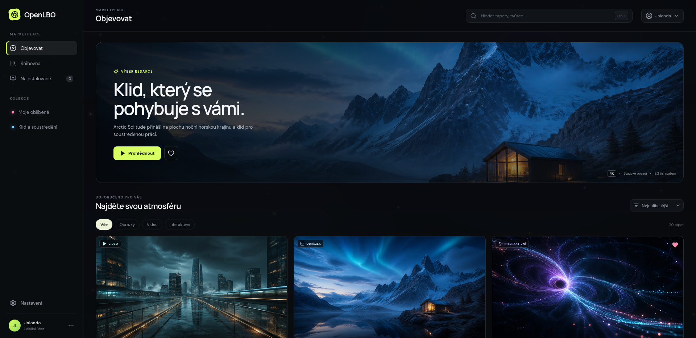
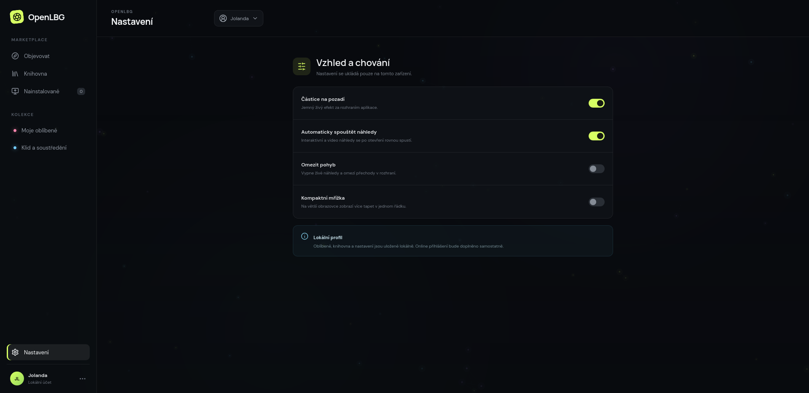

# OpenLBG

Marketplace s obrázkovými, video a interaktivními tapetami pro Linux. Uživatelské rozhraní běží v Reactu/Vite a desktopový obal zajišťuje Tauri 2.

> **Stav:** lokální browserový build a Rust unit testy jsou ověřené. Tauri desktopový smoke test, signing, updater a produkční release acceptance zůstávají otevřené.



## Co aplikace umí

- marketplace s 20 lokálními demo tapetami;
- vyhledávání podle názvu, autora, typu a tagů;
- filtrování na obrázky, video a interaktivní tapety;
- řazení podle oblíbenosti, data, názvu nebo velikosti souboru;
- detailní náhled s metadaty, oblíbenými položkami a knihovnou;
- kolekce **Moje oblíbené** a **Klid a soustředění**;
- lokální persistence oblíbených, knihovny, řazení a nastavení;
- ambientní částice, interaktivní canvas/WebGL efekty a volbu omezení pohybu;
- Tauri příkazy pro zjištění instalací, nastavení a odinstalaci tapety.

### Desktopová integrace

Nativní vrstva v `src-tauri` obsahuje adaptéry pro GNOME, KDE Plasma, Cinnamon, MATE, XFCE, Hyprland a Sway. Interaktivní tapety mají pro GNOME živý režim; v ostatních prostředích se podle typu použije poster frame nebo příslušný systémový mechanismus.

Online přihlášení zatím není zapojené. Profil, oblíbené položky, knihovna a nastavení jsou lokální.

## Screenshoty

### Marketplace


### Nastavení



Screenshoty vznikly z lokálního Vite preview při desktopovém viewportu 1920 × 935 px. Zachycují browserové UI, nikoli nativní Tauri chrome.

## Technologie

| Vrstva | Technologie |
| --- | --- |
| UI | React `^18.3.1`, React DOM `^18.3.1` |
| Build | Vite `^6.0.5` (lokálně vyřešeno `6.4.3`) |
| Ikony | Lucide React `^0.468.0` |
| Desktop | Tauri `2`, `@tauri-apps/api ^2.8.0`, Tauri CLI `^2.8.4` |
| Nativní backend | Rust 2021, `serde`, `serde_json` |

Verze a příkazy jsou vedené v `package.json`, `package-lock.json`, `src-tauri/Cargo.toml` a `src-tauri/tauri.conf.json`.

## Požadavky

- Node.js a npm pro browserový UI;
- Rust a Cargo pro Tauri desktopovou variantu;
- systémové závislosti Tauri podle cílové distribuce Linuxu — viz [oficiální Tauri prerequisites](https://tauri.app/start/prerequisites/).

Lokální ověřovací prostředí použité pro tento stav: Node.js `v22.23.1`, npm `10.9.8`, Rust/Cargo `1.97.1`.

## Spuštění browserového UI

```bash
npm install
npm run dev
```

Preview se spouští na `http://127.0.0.1:1420/`.

Produkční webový build:

```bash
npm run build
npm run preview
```

## Spuštění desktopové aplikace

```bash
npm install
npm run tauri dev
```

Linuxové balíčky (`.deb`, `.rpm`, `.AppImage`) jsou nakonfigurované přes Tauri bundler:

```bash
npm run tauri build
```

Konfigurace cílových balíčků je v `src-tauri/tauri.conf.json`. Lokální dostupnost balíčku sama o sobě neprokazuje signing, updater, target-host smoke ani produkční podporu.

## Ověření

Aktuální stav byl ověřen těmito kroky:

```bash
npm run build
cd src-tauri && cargo test
```

Výsledek:

- `npm run build` — **PASS**, Vite transformoval 1606 modulů;
- `cargo test` — **PASS**, 2 testy prošly, 0 selhalo;
- browser smoke — **PASS**, preview vrátilo HTTP 200, UI se vykreslilo včetně marketplace a Nastavení, zachyceno 0 JS chyb a nebyl nalezen horizontální overflow.

## Stav a otevřené hranice

### Ověřeno

- React/Vite browser UI se sestaví;
- hlavní marketplace a Nastavení se vykreslí v desktopovém viewportu;
- lokální vyhledávání, navigace, filtry, nastavení a persistence jsou přítomné v UI;
- Rust unit testy katalogu a unikátních názvů souborů procházejí.

### Otevřené

- nativní Tauri runtime smoke s reálným nastavením tapety v každém desktopovém prostředí;
- instalace/upgrade/uninstall cílových balíčků;
- signing, notarizace, updater a veřejný release kanál;
- online přihlášení a vzdálený marketplace backend;
- automatizovaná CI/release pipeline.

Tyto položky nejsou nahrazené lokálním buildem ani screenshotem.

## Struktura

```text
src/                 React aplikace, katalog, efekty a styly
src-tauri/           Tauri 2 shell a Rust desktopová integrace
gnome-extension/     GNOME live-wallpaper extension
docs/screenshots/    Ověřené screenshoty pro dokumentaci
artifacts/           Lokální build artefakty; nejsou součástí zdrojové publikace
```

## Licence

Zdrojový kód OpenLBG je dostupný pod [MIT License](LICENSE). Oznámení k referenčním projektům a třetím stranám jsou v [THIRD_PARTY_NOTICES.md](THIRD_PARTY_NOTICES.md).
